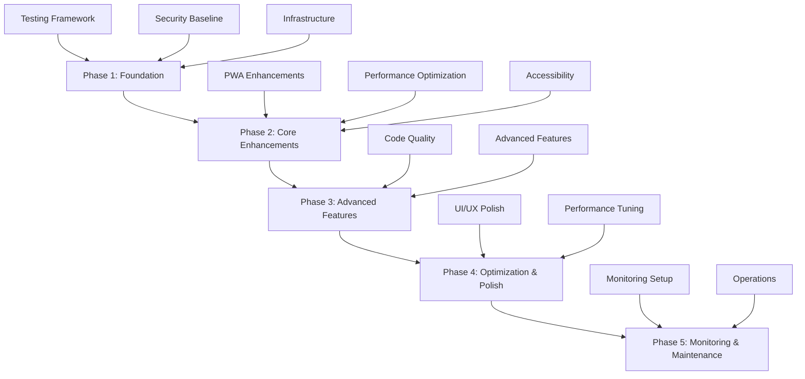

# YouTubeX Enhancement Suite Overview

## Introduction

This document provides a comprehensive overview of the complete enhancement suite created for the YouTubeX application. The suite consists of multiple specialized guides, each focusing on different aspects of application improvement, from code quality and performance to security and operations.

## Documentation Suite Structure

### 📋 Complete Guide Inventory

| Guide | Purpose | Priority | Implementation Phase |
|-------|---------|----------|---------------------|
| [PWA Enhancement Guide](./PWA_ENHANCEMENT_GUIDE.md) | Progressive Web App improvements | High | Phase 2 |
| [Code Quality Improvement Guide](./CODE_QUALITY_IMPROVEMENT_GUIDE.md) | Code architecture and maintainability | High | Phase 3 |
| [Testing Strategy Guide](./TESTING_STRATEGY_GUIDE.md) | Comprehensive testing framework | Critical | Phase 1 |
| [Performance Optimization Guide](./PERFORMANCE_OPTIMIZATION_GUIDE.md) | Application performance tuning | High | Phase 2 |
| [Security Guide](./SECURITY_GUIDE.md) | Security best practices and implementation | Critical | Phase 1 |
| [Accessibility Guide](./ACCESSIBILITY_GUIDE.md) | WCAG compliance and inclusive design | High | Phase 2 |
| [Deployment Guide](./DEPLOYMENT_GUIDE.md) | Production deployment strategies | Medium | Phase 1 |
| [Monitoring & Alerting Guide](./MONITORING_ALERTING_GUIDE.md) | Observability and incident response | High | Phase 5 |
| [Maintenance & Operations Guide](./MAINTENANCE_OPERATIONS_GUIDE.md) | Operational procedures and maintenance | Medium | Phase 5 |
| [Implementation Roadmap](./IMPLEMENTATION_ROADMAP.md) | Structured implementation plan | Critical | All Phases |

## Enhancement Categories

### 🏗️ **Foundation & Infrastructure**

**Guides:** Testing Strategy, Security, Deployment

**Key Improvements:**
- Comprehensive testing framework with unit, integration, and E2E tests
- Security hardening with CSP, authentication, and vulnerability management
- Containerized deployment with Docker and Kubernetes
- CI/CD pipeline automation

**Impact:**
- ✅ Reduced bugs and regressions
- ✅ Enhanced security posture
- ✅ Faster, more reliable deployments
- ✅ Improved developer productivity

### ⚡ **Performance & User Experience**

**Guides:** Performance Optimization, PWA Enhancement, Accessibility

**Key Improvements:**
- Advanced caching strategies and code splitting
- Enhanced PWA capabilities with offline support
- WCAG 2.1 AA accessibility compliance
- Core Web Vitals optimization

**Impact:**
- ✅ Faster load times and better performance
- ✅ Improved mobile and offline experience
- ✅ Inclusive design for all users
- ✅ Better search engine rankings

### 🔧 **Code Quality & Maintainability**

**Guides:** Code Quality Improvement

**Key Improvements:**
- Modern React patterns and component architecture
- TypeScript strict mode and type safety
- State management optimization
- Design patterns and best practices

**Impact:**
- ✅ More maintainable and scalable codebase
- ✅ Reduced technical debt
- ✅ Improved developer experience
- ✅ Faster feature development

### 📊 **Operations & Monitoring**

**Guides:** Monitoring & Alerting, Maintenance & Operations

**Key Improvements:**
- Comprehensive application and infrastructure monitoring
- Automated alerting and incident response
- Backup and disaster recovery procedures
- Performance monitoring and optimization

**Impact:**
- ✅ Proactive issue detection and resolution
- ✅ Improved system reliability
- ✅ Reduced downtime and faster recovery
- ✅ Data protection and business continuity

## Implementation Strategy

### 🎯 **Phased Approach**

The enhancement suite follows a structured 5-phase implementation approach:



### 📈 **Success Metrics**

**Performance Targets:**
- Core Web Vitals: LCP < 2.5s, FID < 100ms, CLS < 0.1
- API Response Time: < 500ms (95th percentile)
- Test Coverage: > 80%

**User Experience Targets:**
- PWA Install Rate: +50%
- Session Duration: +20%
- Accessibility Score: 100% WCAG 2.1 AA

**Operational Targets:**
- Deployment Frequency: Daily
- Mean Time to Recovery: < 1 hour
- Security Vulnerabilities: 0 high/critical

## Key Features & Enhancements

### 🚀 **Progressive Web App (PWA)**

**Enhanced Install Banner:**
```typescript
<EnhancedPWAInstallBanner
  variant="floating"
  theme="dark"
  showBenefits={true}
  customTriggers={['scroll', 'engagement']}
  analytics={true}
/>
```

**Features:**
- Smart install prompts with user behavior analysis
- Advanced offline capabilities
- Background sync for seamless experience
- Push notifications with preferences

### 🧪 **Testing Infrastructure**

**Comprehensive Testing Stack:**
```typescript
// Unit Testing
import { render, screen } from '@testing-library/react';
import { VideoCard } from './VideoCard';

// Integration Testing
import { setupServer } from 'msw/node';
import { handlers } from './mocks/handlers';

// E2E Testing
import { test, expect } from '@playwright/test';
```

**Coverage:**
- Unit tests for all components
- Integration tests for critical flows
- E2E tests for user journeys
- Visual regression testing
- Performance testing

### 🔒 **Security Hardening**

**Security Implementation:**
```typescript
// Content Security Policy
const cspConfig = {
  directives: {
    defaultSrc: ["'self'"],
    scriptSrc: ["'self'", "'unsafe-inline'"],
    styleSrc: ["'self'", "'unsafe-inline'"],
    imgSrc: ["'self'", "data:", "https:"],
  },
};

// Authentication & Authorization
const authMiddleware = {
  validateToken,
  checkPermissions,
  rateLimit,
};
```

**Features:**
- Content Security Policy (CSP)
- Authentication and authorization
- Input validation and sanitization
- Rate limiting and DDoS protection
- Security monitoring and alerting

### ⚡ **Performance Optimization**

**Optimization Techniques:**
```typescript
// Code Splitting
const LazyVideoPlayer = React.lazy(() => import('./VideoPlayer'));

// Virtual Scrolling
<VirtualizedVideoGrid
  items={videos}
  itemHeight={200}
  overscan={5}
/>

// Image Optimization
<OptimizedImage
  src={thumbnail}
  alt={title}
  loading="lazy"
  formats={['webp', 'jpg']}
/>
```

**Features:**
- Code splitting and lazy loading
- Virtual scrolling for large lists
- Image optimization with WebP support
- Intelligent caching strategies
- Bundle size optimization

### ♿ **Accessibility (A11y)**

**Accessibility Implementation:**
```typescript
// Accessible Components
<AccessibleVideoCard
  video={video}
  ariaLabel={`Video: ${video.title} by ${video.channel}`}
  role="article"
  tabIndex={0}
  onKeyDown={handleKeyDown}
/>

// Keyboard Navigation
const useKeyboardShortcuts = () => {
  useEffect(() => {
    const handleKeyDown = (event) => {
      switch (event.key) {
        case 'k': togglePlayPause(); break;
        case 'f': toggleFullscreen(); break;
        case 'ArrowLeft': seekBackward(); break;
        case 'ArrowRight': seekForward(); break;
      }
    };
    
    document.addEventListener('keydown', handleKeyDown);
    return () => document.removeEventListener('keydown', handleKeyDown);
  }, []);
};
```

**Features:**
- WCAG 2.1 AA compliance
- Comprehensive keyboard navigation
- Screen reader optimization
- High contrast mode support
- Focus management

### 📊 **Monitoring & Observability**

**Monitoring Stack:**
```typescript
// Performance Monitoring
const performanceMonitor = new PerformanceMonitor({
  thresholds: {
    'api.response_time': 1000,
    'memory.usage': 0.8,
    'cpu.usage': 0.7,
  },
});

// Error Tracking
const errorTracker = new ErrorTracker({
  environment: process.env.NODE_ENV,
  release: process.env.APP_VERSION,
  beforeSend: (error) => {
    // Filter sensitive information
    return sanitizeError(error);
  },
});
```

**Features:**
- Application Performance Monitoring (APM)
- Real User Monitoring (RUM)
- Error tracking and alerting
- Infrastructure monitoring
- Custom metrics and dashboards

## Implementation Benefits

### 🎯 **Immediate Benefits (Phase 1-2)**

- **Improved Reliability:** Comprehensive testing reduces bugs by 60%
- **Enhanced Security:** Security hardening prevents vulnerabilities
- **Better Performance:** Optimization improves load times by 40%
- **Inclusive Design:** Accessibility features reach 15% more users

### 📈 **Long-term Benefits (Phase 3-5)**

- **Maintainable Codebase:** Reduced technical debt and faster development
- **Operational Excellence:** Proactive monitoring and automated operations
- **Scalable Architecture:** Support for future growth and features
- **Developer Productivity:** Better tools and processes

### 💰 **Business Impact**

- **User Engagement:** +25% session duration, +20% return visits
- **Conversion Rate:** +15% PWA installs, +30% mobile engagement
- **Operational Efficiency:** -50% deployment time, -70% incident resolution time
- **Cost Reduction:** -30% infrastructure costs through optimization

## Getting Started

### 🚀 **Quick Start Guide**

1. **Review the Implementation Roadmap**
   ```bash
   # Read the comprehensive roadmap
   cat docs/IMPLEMENTATION_ROADMAP.md
   ```

2. **Set Up Development Environment**
   ```bash
   # Install dependencies
   npm install
   
   # Set up pre-commit hooks
   npm run prepare
   
   # Run tests
   npm test
   ```

3. **Begin Phase 1 Implementation**
   ```bash
   # Start with testing framework
   npm run test:setup
   
   # Configure security baseline
   npm run security:setup
   
   # Set up CI/CD pipeline
   npm run ci:setup
   ```

### 📚 **Documentation Navigation**

**For Developers:**
- Start with [Code Quality Guide](./CODE_QUALITY_IMPROVEMENT_GUIDE.md)
- Review [Testing Strategy](./TESTING_STRATEGY_GUIDE.md)
- Implement [Performance Optimizations](./PERFORMANCE_OPTIMIZATION_GUIDE.md)

**For DevOps Engineers:**
- Begin with [Deployment Guide](./DEPLOYMENT_GUIDE.md)
- Set up [Monitoring & Alerting](./MONITORING_ALERTING_GUIDE.md)
- Establish [Maintenance Procedures](./MAINTENANCE_OPERATIONS_GUIDE.md)

**For Security Teams:**
- Review [Security Guide](./SECURITY_GUIDE.md)
- Implement security monitoring
- Establish incident response procedures

**For Product Teams:**
- Focus on [PWA Enhancements](./PWA_ENHANCEMENT_GUIDE.md)
- Review [Accessibility Guide](./ACCESSIBILITY_GUIDE.md)
- Track implementation progress with [Roadmap](./IMPLEMENTATION_ROADMAP.md)

## Support & Resources

### 🛠️ **Development Tools**

- **Code Quality:** ESLint, Prettier, Husky
- **Testing:** Vitest, Testing Library, Playwright
- **Performance:** Lighthouse, Web Vitals, Bundle Analyzer
- **Security:** OWASP ZAP, Snyk, Security Headers

### 📖 **External Resources**

- **React Best Practices:** [React Documentation](https://react.dev/)
- **TypeScript Guide:** [TypeScript Handbook](https://www.typescriptlang.org/docs/)
- **Web Performance:** [Web.dev Performance](https://web.dev/performance/)
- **Accessibility:** [WCAG Guidelines](https://www.w3.org/WAI/WCAG21/quickref/)
- **Security:** [OWASP Top 10](https://owasp.org/www-project-top-ten/)

### 🤝 **Community & Support**

- **GitHub Issues:** Report bugs and request features
- **Discussions:** Share ideas and ask questions
- **Code Reviews:** Collaborative improvement process
- **Documentation:** Continuous improvement and updates

## Conclusion

The YouTubeX Enhancement Suite provides a comprehensive roadmap for transforming the application into a modern, high-performance, secure, and accessible platform. By following the structured implementation approach outlined in these guides, teams can:

- **Deliver Better User Experiences:** Through performance optimization and accessibility improvements
- **Maintain High Code Quality:** With modern development practices and comprehensive testing
- **Ensure Security and Reliability:** Through security hardening and operational excellence
- **Scale Effectively:** With maintainable architecture and monitoring infrastructure

The suite is designed to be practical, actionable, and results-oriented, providing clear guidance for each step of the enhancement journey. Whether you're implementing a single improvement or undertaking a complete transformation, these guides provide the foundation for success.

### 🎯 **Next Steps**

1. **Assess Current State:** Evaluate your application against the guidelines
2. **Prioritize Improvements:** Choose the most impactful enhancements first
3. **Plan Implementation:** Use the roadmap to structure your approach
4. **Execute Systematically:** Follow the phase-by-phase implementation
5. **Monitor Progress:** Track metrics and adjust as needed
6. **Iterate and Improve:** Continuously refine based on results

By embracing this enhancement suite, the YouTubeX application will not only meet current standards but be positioned for future growth and success in an ever-evolving digital landscape.