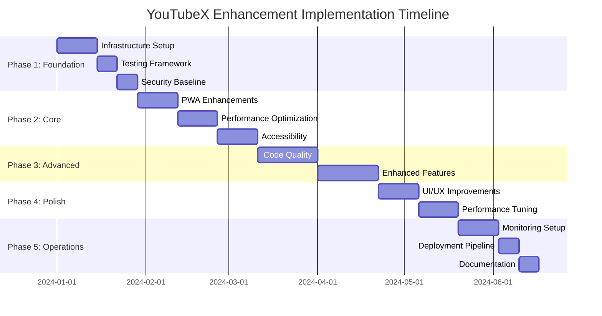

# Implementation Roadmap

## Overview

This comprehensive roadmap provides a structured approach to implementing all the enhancements outlined in our documentation suite. The roadmap is organized into phases, with each phase building upon the previous one to ensure a smooth and systematic improvement of the YouTubeX application.

## Table of Contents

1. [Implementation Phases](#implementation-phases)
2. [Phase 1: Foundation & Infrastructure](#phase-1-foundation--infrastructure)
3. [Phase 2: Core Enhancements](#phase-2-core-enhancements)
4. [Phase 3: Advanced Features](#phase-3-advanced-features)
5. [Phase 4: Optimization & Polish](#phase-4-optimization--polish)
6. [Phase 5: Monitoring & Maintenance](#phase-5-monitoring--maintenance)
7. [Timeline Estimates](#timeline-estimates)
8. [Resource Requirements](#resource-requirements)
9. [Risk Assessment](#risk-assessment)
10. [Success Metrics](#success-metrics)

## Implementation Phases

### Phase Overview



## Phase 1: Foundation & Infrastructure

### Duration: 4 weeks
### Priority: Critical

#### Week 1-2: Infrastructure Setup

**Objectives:**
- Establish robust development and deployment infrastructure
- Set up monitoring and logging foundations
- Implement security baseline

**Tasks:**

1. **Development Environment Enhancement**
   ```bash
   # Set up development tools
   npm install --save-dev @typescript-eslint/eslint-plugin
   npm install --save-dev @typescript-eslint/parser
   npm install --save-dev prettier
   npm install --save-dev husky
   npm install --save-dev lint-staged
   
   # Configure pre-commit hooks
   npx husky install
   npx husky add .husky/pre-commit "npm run lint-staged"
   ```

2. **Docker & Containerization**
   - Implement multi-stage Dockerfile from `DEPLOYMENT_GUIDE.md`
   - Set up Docker Compose for local development
   - Configure container health checks

3. **CI/CD Pipeline**
   - Implement GitHub Actions workflow
   - Set up automated testing
   - Configure deployment automation

4. **Security Infrastructure**
   - Implement Content Security Policy
   - Set up security headers
   - Configure HTTPS and SSL certificates

**Deliverables:**
- ✅ Enhanced development environment
- ✅ Containerized application
- ✅ Automated CI/CD pipeline
- ✅ Security baseline implementation

#### Week 3: Testing Framework

**Objectives:**
- Establish comprehensive testing infrastructure
- Implement automated testing pipeline

**Tasks:**

1. **Unit Testing Setup**
   ```typescript
   // Install testing dependencies
   npm install --save-dev vitest @testing-library/react @testing-library/jest-dom
   npm install --save-dev @testing-library/user-event msw
   ```

2. **Integration Testing**
   - Set up API testing with MSW
   - Configure database testing
   - Implement component integration tests

3. **E2E Testing**
   - Set up Playwright for end-to-end testing
   - Create critical user journey tests
   - Configure visual regression testing

**Deliverables:**
- ✅ Complete testing framework
- ✅ Automated test execution
- ✅ Test coverage reporting

#### Week 4: Security & Monitoring Baseline

**Objectives:**
- Implement security monitoring
- Set up basic application monitoring

**Tasks:**

1. **Security Monitoring**
   - Implement security event logging
   - Set up intrusion detection
   - Configure vulnerability scanning

2. **Application Monitoring**
   - Set up basic metrics collection
   - Implement health checks
   - Configure alerting

**Deliverables:**
- ✅ Security monitoring system
- ✅ Basic application monitoring
- ✅ Alerting infrastructure

## Phase 2: Core Enhancements

### Duration: 6 weeks
### Priority: High

#### Week 5-6: PWA Enhancements

**Objectives:**
- Implement enhanced PWA functionality
- Improve offline capabilities
- Enhance user engagement

**Tasks:**

1. **Enhanced PWA Install Banner**
   ```typescript
   // Implement EnhancedPWAInstallBanner.tsx
   import { EnhancedPWAInstallBanner } from './components/EnhancedPWAInstallBanner';
   
   // Replace existing PWA banner
   <EnhancedPWAInstallBanner
     variant="floating"
     theme="dark"
     showBenefits={true}
     customTriggers={['scroll', 'engagement']}
   />
   ```

2. **Advanced Service Worker**
   - Implement intelligent caching strategies
   - Add background sync capabilities
   - Enhance offline functionality

3. **Push Notifications**
   - Set up push notification infrastructure
   - Implement notification preferences
   - Create notification templates

**Deliverables:**
- ✅ Enhanced PWA install experience
- ✅ Advanced offline capabilities
- ✅ Push notification system

#### Week 7-8: Performance Optimization

**Objectives:**
- Implement performance optimizations
- Reduce bundle size and load times
- Optimize runtime performance

**Tasks:**

1. **Bundle Optimization**
   ```typescript
   // Implement code splitting
   const LazyComponent = React.lazy(() => import('./components/HeavyComponent'));
   
   // Use dynamic imports
   const loadFeature = () => import('./features/advanced-feature');
   ```

2. **Image Optimization**
   - Implement progressive image loading
   - Add WebP support with fallbacks
   - Optimize image delivery

3. **Virtual Scrolling**
   - Implement virtualized video grids
   - Optimize large list rendering
   - Add intersection observer optimizations

**Deliverables:**
- ✅ Optimized bundle size
- ✅ Improved load times
- ✅ Enhanced runtime performance

#### Week 9-10: Accessibility Implementation

**Objectives:**
- Achieve WCAG 2.1 AA compliance
- Implement comprehensive accessibility features
- Add accessibility testing

**Tasks:**

1. **Semantic HTML & ARIA**
   ```typescript
   // Implement accessible components
   <AccessibleVideoCard
     video={video}
     ariaLabel={`Video: ${video.title} by ${video.channel}`}
     role="article"
   />
   ```

2. **Keyboard Navigation**
   - Implement comprehensive keyboard support
   - Add focus management
   - Create keyboard shortcuts

3. **Screen Reader Support**
   - Add proper ARIA labels
   - Implement live regions
   - Optimize screen reader experience

**Deliverables:**
- ✅ WCAG 2.1 AA compliance
- ✅ Comprehensive keyboard support
- ✅ Screen reader optimization

## Phase 3: Advanced Features

### Duration: 6 weeks
### Priority: Medium-High

#### Week 11-13: Code Quality & Architecture

**Objectives:**
- Refactor codebase for better maintainability
- Implement design patterns
- Enhance type safety

**Tasks:**

1. **Component Architecture Refactoring**
   ```typescript
   // Implement compound components pattern
   <VideoCard>
     <VideoCard.Thumbnail src={video.thumbnail} />
     <VideoCard.Content>
       <VideoCard.Title>{video.title}</VideoCard.Title>
       <VideoCard.Metadata>
         <VideoCard.Channel>{video.channel}</VideoCard.Channel>
         <VideoCard.Stats views={video.views} />
       </VideoCard.Metadata>
     </VideoCard.Content>
   </VideoCard>
   ```

2. **State Management Optimization**
   - Implement Zustand for global state
   - Optimize React Context usage
   - Add state persistence

3. **Type Safety Enhancement**
   - Implement strict TypeScript configuration
   - Add runtime type validation
   - Create comprehensive type definitions

**Deliverables:**
- ✅ Improved component architecture
- ✅ Optimized state management
- ✅ Enhanced type safety

#### Week 14-16: Enhanced Features

**Objectives:**
- Implement advanced user features
- Add analytics and tracking
- Enhance user experience

**Tasks:**

1. **Advanced Search & Filtering**
   ```typescript
   // Implement enhanced search
   <AdvancedSearch
     filters={{
       duration: ['short', 'medium', 'long'],
       uploadDate: ['hour', 'day', 'week', 'month'],
       quality: ['4K', 'HD', 'SD']
     }}
     onSearch={handleAdvancedSearch}
   />
   ```

2. **Personalization Engine**
   - Implement recommendation algorithms
   - Add user preference learning
   - Create personalized feeds

3. **Analytics Integration**
   - Add user behavior tracking
   - Implement performance analytics
   - Create analytics dashboard

**Deliverables:**
- ✅ Advanced search capabilities
- ✅ Personalization features
- ✅ Analytics integration

## Phase 4: Optimization & Polish

### Duration: 4 weeks
### Priority: Medium

#### Week 17-18: UI/UX Improvements

**Objectives:**
- Polish user interface
- Enhance user experience
- Implement design system

**Tasks:**

1. **Design System Implementation**
   ```typescript
   // Create unified design tokens
   export const designTokens = {
     colors: {
       primary: {
         50: '#eff6ff',
         500: '#3b82f6',
         900: '#1e3a8a'
       }
     },
     spacing: {
       xs: '0.25rem',
       sm: '0.5rem',
       md: '1rem'
     }
   };
   ```

2. **Animation & Transitions**
   - Add smooth transitions
   - Implement loading animations
   - Create micro-interactions

3. **Responsive Design Enhancement**
   - Optimize mobile experience
   - Improve tablet layouts
   - Add touch gestures

**Deliverables:**
- ✅ Unified design system
- ✅ Enhanced animations
- ✅ Improved responsive design

#### Week 19-20: Performance Tuning

**Objectives:**
- Fine-tune application performance
- Optimize Core Web Vitals
- Implement advanced caching

**Tasks:**

1. **Core Web Vitals Optimization**
   - Optimize Largest Contentful Paint (LCP)
   - Minimize Cumulative Layout Shift (CLS)
   - Improve First Input Delay (FID)

2. **Advanced Caching**
   - Implement intelligent cache strategies
   - Add cache invalidation logic
   - Optimize cache hit rates

3. **Memory Optimization**
   - Implement memory leak detection
   - Optimize component lifecycle
   - Add garbage collection optimization

**Deliverables:**
- ✅ Optimized Core Web Vitals
- ✅ Advanced caching system
- ✅ Memory optimization

## Phase 5: Monitoring & Maintenance

### Duration: 4 weeks
### Priority: High

#### Week 21-22: Comprehensive Monitoring

**Objectives:**
- Implement comprehensive monitoring
- Set up alerting systems
- Create operational dashboards

**Tasks:**

1. **Application Performance Monitoring**
   ```typescript
   // Implement APM integration
   import { performanceMonitor } from './utils/performance-monitor';
   
   // Monitor API calls
   const monitoredFetch = performanceMonitor.monitorDatabaseQuery(
     'fetchVideos',
     () => fetch('/api/videos')
   );
   ```

2. **Infrastructure Monitoring**
   - Set up Prometheus metrics
   - Configure Grafana dashboards
   - Implement log aggregation

3. **Alerting & Incident Response**
   - Configure alert rules
   - Set up notification channels
   - Create incident response procedures

**Deliverables:**
- ✅ Comprehensive monitoring system
- ✅ Operational dashboards
- ✅ Alerting infrastructure

#### Week 23-24: Deployment & Operations

**Objectives:**
- Finalize deployment pipeline
- Implement operational procedures
- Create maintenance schedules

**Tasks:**

1. **Production Deployment**
   - Configure production environment
   - Implement blue-green deployment
   - Set up rollback procedures

2. **Operational Procedures**
   - Create runbooks
   - Implement backup procedures
   - Set up maintenance schedules

3. **Documentation & Training**
   - Complete operational documentation
   - Create training materials
   - Conduct team training sessions

**Deliverables:**
- ✅ Production deployment pipeline
- ✅ Operational procedures
- ✅ Complete documentation

## Timeline Estimates

### Overall Timeline: 24 weeks (6 months)

| Phase | Duration | Start Week | End Week | Dependencies |
|-------|----------|------------|----------|--------------|
| Phase 1: Foundation | 4 weeks | Week 1 | Week 4 | None |
| Phase 2: Core | 6 weeks | Week 5 | Week 10 | Phase 1 |
| Phase 3: Advanced | 6 weeks | Week 11 | Week 16 | Phase 2 |
| Phase 4: Polish | 4 weeks | Week 17 | Week 20 | Phase 3 |
| Phase 5: Operations | 4 weeks | Week 21 | Week 24 | Phase 4 |

### Parallel Execution Opportunities

- **Testing** can be implemented alongside feature development
- **Documentation** can be created in parallel with implementation
- **Monitoring setup** can begin during Phase 3

## Resource Requirements

### Team Composition

**Core Team (Minimum):**
- 1 Senior Frontend Developer
- 1 DevOps Engineer
- 1 QA Engineer
- 1 UI/UX Designer

**Extended Team (Optimal):**
- 2 Senior Frontend Developers
- 1 Backend Developer
- 1 DevOps Engineer
- 1 QA Engineer
- 1 UI/UX Designer
- 1 Product Manager

### Infrastructure Requirements

**Development:**
- Development servers
- Testing environments
- CI/CD infrastructure

**Production:**
- Load balancers
- Application servers
- Database servers
- Monitoring infrastructure
- CDN services

### Budget Considerations

**Infrastructure Costs:**
- Cloud hosting: $500-2000/month
- Monitoring tools: $200-500/month
- Third-party services: $100-300/month

**Development Tools:**
- IDE licenses: $100-300/developer
- Testing tools: $200-500/month
- Design tools: $100-200/month

## Risk Assessment

### High-Risk Items

1. **Performance Regression**
   - **Risk:** New features may impact performance
   - **Mitigation:** Continuous performance monitoring, performance budgets
   - **Contingency:** Performance rollback procedures

2. **Security Vulnerabilities**
   - **Risk:** New features may introduce security issues
   - **Mitigation:** Security reviews, automated scanning
   - **Contingency:** Security incident response plan

3. **Browser Compatibility**
   - **Risk:** Advanced features may not work in all browsers
   - **Mitigation:** Progressive enhancement, feature detection
   - **Contingency:** Graceful degradation strategies

### Medium-Risk Items

1. **Third-party Dependencies**
   - **Risk:** External services may become unavailable
   - **Mitigation:** Fallback mechanisms, service redundancy

2. **Data Migration**
   - **Risk:** Database changes may cause data loss
   - **Mitigation:** Comprehensive backup procedures, migration testing

3. **User Adoption**
   - **Risk:** Users may not adopt new features
   - **Mitigation:** User testing, gradual rollout, feedback collection

## Success Metrics

### Performance Metrics

**Core Web Vitals:**
- LCP: < 2.5 seconds
- FID: < 100 milliseconds
- CLS: < 0.1

**Application Performance:**
- API response time: < 500ms (95th percentile)
- Page load time: < 3 seconds
- Time to Interactive: < 5 seconds

### User Experience Metrics

**Engagement:**
- Session duration: +20%
- Page views per session: +15%
- Bounce rate: -10%

**Accessibility:**
- WCAG 2.1 AA compliance: 100%
- Keyboard navigation coverage: 100%
- Screen reader compatibility: 100%

### Technical Metrics

**Code Quality:**
- Test coverage: > 80%
- TypeScript strict mode: 100%
- ESLint violations: 0

**Security:**
- Security vulnerabilities: 0 high/critical
- Security headers: 100% implemented
- HTTPS coverage: 100%

### Business Metrics

**PWA Adoption:**
- Install rate: +50%
- Return user rate: +25%
- Offline usage: +100%

**Operational Efficiency:**
- Deployment frequency: Daily
- Mean time to recovery: < 1 hour
- Change failure rate: < 5%

## Implementation Guidelines

### Development Practices

1. **Feature Flags**
   ```typescript
   // Use feature flags for gradual rollout
   const isFeatureEnabled = useFeatureFlag('enhanced-video-player');
   
   return (
     <div>
       {isFeatureEnabled ? (
         <EnhancedVideoPlayer />
       ) : (
         <StandardVideoPlayer />
       )}
     </div>
   );
   ```

2. **Progressive Enhancement**
   - Implement core functionality first
   - Add enhancements as layers
   - Ensure graceful degradation

3. **Continuous Integration**
   - Automated testing on every commit
   - Performance regression testing
   - Security vulnerability scanning

### Quality Assurance

1. **Testing Strategy**
   - Unit tests for all new components
   - Integration tests for critical paths
   - E2E tests for user journeys

2. **Code Review Process**
   - Mandatory peer reviews
   - Security review for sensitive changes
   - Performance review for optimization changes

3. **Documentation Requirements**
   - API documentation
   - Component documentation
   - Operational runbooks

## Conclusion

This implementation roadmap provides a structured approach to enhancing the YouTubeX application over a 6-month period. By following this phased approach, we can ensure:

- **Systematic Progress:** Each phase builds upon the previous one
- **Risk Mitigation:** Potential issues are identified and addressed early
- **Quality Assurance:** Comprehensive testing and monitoring throughout
- **Measurable Success:** Clear metrics for tracking progress and success

The roadmap is designed to be flexible, allowing for adjustments based on changing requirements, resource availability, and emerging priorities. Regular reviews and updates should be conducted to ensure the roadmap remains aligned with business objectives and technical constraints.

### Next Steps

1. **Team Assembly:** Gather the required team members
2. **Environment Setup:** Prepare development and testing environments
3. **Stakeholder Alignment:** Ensure all stakeholders understand the roadmap
4. **Kick-off Meeting:** Conduct project kick-off with the entire team
5. **Phase 1 Execution:** Begin implementation with Phase 1 tasks

By following this roadmap, the YouTubeX application will be transformed into a high-performance, accessible, secure, and maintainable platform that provides an exceptional user experience while meeting modern web standards and best practices.