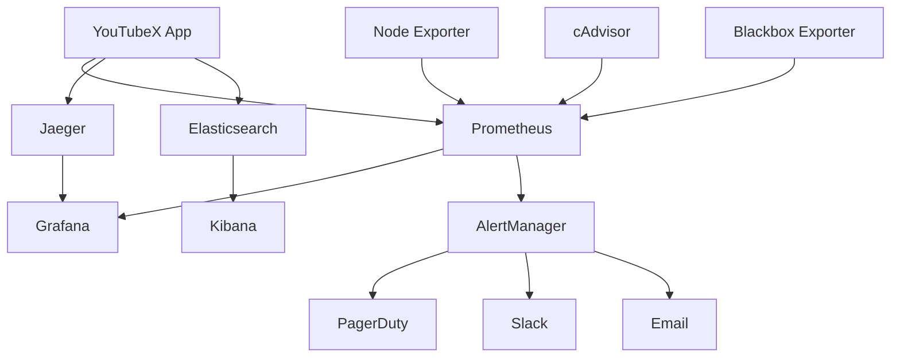

# Monitoring and Alerting Guide

## Overview

This guide provides comprehensive monitoring and alerting strategies for the YouTubeX application, covering application performance monitoring (APM), infrastructure monitoring, log aggregation, alerting rules, and incident response procedures.

## Table of Contents

1. [Monitoring Architecture](#monitoring-architecture)
2. [Application Performance Monitoring](#application-performance-monitoring)
3. [Infrastructure Monitoring](#infrastructure-monitoring)
4. [Log Management](#log-management)
5. [Alerting Strategy](#alerting-strategy)
6. [Dashboards](#dashboards)
7. [Incident Response](#incident-response)
8. [SLA/SLO Management](#slaslo-management)
9. [Cost Monitoring](#cost-monitoring)
10. [Implementation Guide](#implementation-guide)

## Monitoring Architecture

### 1. **Monitoring Stack Overview**



### 2. **Monitoring Components**

```yaml
# monitoring/docker-compose.yml
version: '3.8'

services:
  prometheus:
    image: prom/prometheus:latest
    container_name: prometheus
    ports:
      - "9090:9090"
    volumes:
      - ./prometheus.yml:/etc/prometheus/prometheus.yml
      - ./rules:/etc/prometheus/rules
      - prometheus-data:/prometheus
    command:
      - '--config.file=/etc/prometheus/prometheus.yml'
      - '--storage.tsdb.path=/prometheus'
      - '--web.console.libraries=/etc/prometheus/console_libraries'
      - '--web.console.templates=/etc/prometheus/consoles'
      - '--storage.tsdb.retention.time=200h'
      - '--web.enable-lifecycle'
    restart: unless-stopped

  grafana:
    image: grafana/grafana:latest
    container_name: grafana
    ports:
      - "3000:3000"
    volumes:
      - grafana-data:/var/lib/grafana
      - ./grafana/provisioning:/etc/grafana/provisioning
      - ./grafana/dashboards:/var/lib/grafana/dashboards
    environment:
      - GF_SECURITY_ADMIN_USER=admin
      - GF_SECURITY_ADMIN_PASSWORD=${GRAFANA_PASSWORD}
      - GF_USERS_ALLOW_SIGN_UP=false
    restart: unless-stopped

  alertmanager:
    image: prom/alertmanager:latest
    container_name: alertmanager
    ports:
      - "9093:9093"
    volumes:
      - ./alertmanager.yml:/etc/alertmanager/alertmanager.yml
      - alertmanager-data:/alertmanager
    command:
      - '--config.file=/etc/alertmanager/alertmanager.yml'
      - '--storage.path=/alertmanager'
      - '--web.external-url=http://localhost:9093'
    restart: unless-stopped

  jaeger:
    image: jaegertracing/all-in-one:latest
    container_name: jaeger
    ports:
      - "16686:16686"
      - "14268:14268"
    environment:
      - COLLECTOR_OTLP_ENABLED=true
    restart: unless-stopped

  elasticsearch:
    image: docker.elastic.co/elasticsearch/elasticsearch:8.8.0
    container_name: elasticsearch
    environment:
      - discovery.type=single-node
      - "ES_JAVA_OPTS=-Xms512m -Xmx512m"
      - xpack.security.enabled=false
    ports:
      - "9200:9200"
    volumes:
      - elasticsearch-data:/usr/share/elasticsearch/data
    restart: unless-stopped

  kibana:
    image: docker.elastic.co/kibana/kibana:8.8.0
    container_name: kibana
    ports:
      - "5601:5601"
    environment:
      - ELASTICSEARCH_HOSTS=http://elasticsearch:9200
    depends_on:
      - elasticsearch
    restart: unless-stopped

  node-exporter:
    image: prom/node-exporter:latest
    container_name: node-exporter
    ports:
      - "9100:9100"
    volumes:
      - /proc:/host/proc:ro
      - /sys:/host/sys:ro
      - /:/rootfs:ro
    command:
      - '--path.procfs=/host/proc'
      - '--path.rootfs=/rootfs'
      - '--path.sysfs=/host/sys'
      - '--collector.filesystem.mount-points-exclude=^/(sys|proc|dev|host|etc)($$|/)'
    restart: unless-stopped

  cadvisor:
    image: gcr.io/cadvisor/cadvisor:latest
    container_name: cadvisor
    ports:
      - "8080:8080"
    volumes:
      - /:/rootfs:ro
      - /var/run:/var/run:ro
      - /sys:/sys:ro
      - /var/lib/docker/:/var/lib/docker:ro
      - /dev/disk/:/dev/disk:ro
    privileged: true
    devices:
      - /dev/kmsg
    restart: unless-stopped

volumes:
  prometheus-data:
  grafana-data:
  alertmanager-data:
  elasticsearch-data:
```

## Application Performance Monitoring

### 1. **Custom Metrics Implementation**

```typescript
// monitoring/metrics.ts
import { register, collectDefaultMetrics, Counter, Histogram, Gauge } from 'prom-client';

// Collect default metrics
collectDefaultMetrics({ register });

// Custom application metrics
export const metrics = {
  // HTTP metrics
  httpRequestDuration: new Histogram({
    name: 'http_request_duration_seconds',
    help: 'Duration of HTTP requests in seconds',
    labelNames: ['method', 'route', 'status_code', 'user_type'],
    buckets: [0.1, 0.3, 0.5, 0.7, 1, 3, 5, 7, 10],
  }),

  httpRequestsTotal: new Counter({
    name: 'http_requests_total',
    help: 'Total number of HTTP requests',
    labelNames: ['method', 'route', 'status_code', 'user_type'],
  }),

  // Business metrics
  videoPlaysTotal: new Counter({
    name: 'video_plays_total',
    help: 'Total number of video plays',
    labelNames: ['video_id', 'quality', 'device_type'],
  }),

  searchQueriesTotal: new Counter({
    name: 'search_queries_total',
    help: 'Total number of search queries',
    labelNames: ['query_type', 'results_count'],
  }),

  userSessionsActive: new Gauge({
    name: 'user_sessions_active',
    help: 'Number of active user sessions',
    labelNames: ['user_type'],
  }),

  subscriptionsTotal: new Counter({
    name: 'subscriptions_total',
    help: 'Total number of channel subscriptions',
    labelNames: ['channel_id'],
  }),

  // Performance metrics
  pageLoadTime: new Histogram({
    name: 'page_load_time_seconds',
    help: 'Page load time in seconds',
    labelNames: ['page', 'device_type'],
    buckets: [0.5, 1, 2, 3, 5, 8, 10, 15],
  }),

  apiResponseTime: new Histogram({
    name: 'api_response_time_seconds',
    help: 'API response time in seconds',
    labelNames: ['endpoint', 'method'],
    buckets: [0.1, 0.25, 0.5, 1, 2.5, 5, 10],
  }),

  // Error metrics
  errorsTotal: new Counter({
    name: 'errors_total',
    help: 'Total number of errors',
    labelNames: ['error_type', 'component', 'severity'],
  }),

  // Cache metrics
  cacheHitsTotal: new Counter({
    name: 'cache_hits_total',
    help: 'Total number of cache hits',
    labelNames: ['cache_type'],
  }),

  cacheMissesTotal: new Counter({
    name: 'cache_misses_total',
    help: 'Total number of cache misses',
    labelNames: ['cache_type'],
  }),

  // Database metrics
  databaseConnectionsActive: new Gauge({
    name: 'database_connections_active',
    help: 'Number of active database connections',
  }),

  databaseQueryDuration: new Histogram({
    name: 'database_query_duration_seconds',
    help: 'Database query duration in seconds',
    labelNames: ['query_type', 'table'],
    buckets: [0.01, 0.05, 0.1, 0.25, 0.5, 1, 2.5, 5],
  }),
};

// Metrics middleware for Express
export const metricsMiddleware = (req: any, res: any, next: any) => {
  const start = Date.now();
  const route = req.route?.path || req.path;
  const userType = req.user?.type || 'anonymous';

  res.on('finish', () => {
    const duration = (Date.now() - start) / 1000;
    
    metrics.httpRequestDuration
      .labels(req.method, route, res.statusCode.toString(), userType)
      .observe(duration);
    
    metrics.httpRequestsTotal
      .labels(req.method, route, res.statusCode.toString(), userType)
      .inc();
  });

  next();
};

// React performance monitoring hook
export const usePerformanceMonitoring = () => {
  useEffect(() => {
    // Monitor Core Web Vitals
    const observer = new PerformanceObserver((list) => {
      for (const entry of list.getEntries()) {
        const deviceType = /Mobile|Android|iPhone|iPad/.test(navigator.userAgent) ? 'mobile' : 'desktop';
        
        switch (entry.entryType) {
          case 'navigation':
            const navEntry = entry as PerformanceNavigationTiming;
            const loadTime = (navEntry.loadEventEnd - navEntry.fetchStart) / 1000;
            metrics.pageLoadTime.labels(window.location.pathname, deviceType).observe(loadTime);
            break;
            
          case 'largest-contentful-paint':
            const lcpEntry = entry as any;
            metrics.pageLoadTime.labels('lcp', deviceType).observe(lcpEntry.startTime / 1000);
            break;
            
          case 'first-input':
            const fidEntry = entry as any;
            metrics.pageLoadTime.labels('fid', deviceType).observe(fidEntry.processingStart - fidEntry.startTime);
            break;
        }
      }
    });

    observer.observe({ entryTypes: ['navigation', 'largest-contentful-paint', 'first-input'] });
    
    return () => observer.disconnect();
  }, []);
};

// Business metrics tracking
export const trackVideoPlay = (videoId: string, quality: string) => {
  const deviceType = /Mobile|Android|iPhone|iPad/.test(navigator.userAgent) ? 'mobile' : 'desktop';
  metrics.videoPlaysTotal.labels(videoId, quality, deviceType).inc();
};

export const trackSearchQuery = (queryType: string, resultsCount: number) => {
  const resultsRange = resultsCount === 0 ? 'zero' : 
                      resultsCount < 10 ? 'low' : 
                      resultsCount < 100 ? 'medium' : 'high';
  metrics.searchQueriesTotal.labels(queryType, resultsRange).inc();
};

export const trackError = (error: Error, component: string, severity: 'low' | 'medium' | 'high' | 'critical') => {
  metrics.errorsTotal.labels(error.name, component, severity).inc();
};
```

### 2. **Real User Monitoring (RUM)**

```typescript
// monitoring/rum.ts
interface RUMData {
  sessionId: string;
  userId?: string;
  page: string;
  timestamp: number;
  metrics: {
    loadTime: number;
    firstContentfulPaint: number;
    largestContentfulPaint: number;
    firstInputDelay: number;
    cumulativeLayoutShift: number;
  };
  errors: Array<{
    message: string;
    stack: string;
    timestamp: number;
  }>;
  interactions: Array<{
    type: string;
    target: string;
    timestamp: number;
  }>;
}

class RealUserMonitoring {
  private sessionId: string;
  private data: RUMData;
  private batchSize = 10;
  private flushInterval = 30000; // 30 seconds
  private queue: RUMData[] = [];

  constructor() {
    this.sessionId = this.generateSessionId();
    this.data = this.initializeData();
    this.setupEventListeners();
    this.startPeriodicFlush();
  }

  private generateSessionId(): string {
    return `${Date.now()}-${Math.random().toString(36).substr(2, 9)}`;
  }

  private initializeData(): RUMData {
    return {
      sessionId: this.sessionId,
      userId: this.getUserId(),
      page: window.location.pathname,
      timestamp: Date.now(),
      metrics: {
        loadTime: 0,
        firstContentfulPaint: 0,
        largestContentfulPaint: 0,
        firstInputDelay: 0,
        cumulativeLayoutShift: 0,
      },
      errors: [],
      interactions: [],
    };
  }

  private setupEventListeners(): void {
    // Performance metrics
    const observer = new PerformanceObserver((list) => {
      for (const entry of list.getEntries()) {
        this.processPerformanceEntry(entry);
      }
    });

    observer.observe({ entryTypes: ['navigation', 'paint', 'largest-contentful-paint', 'first-input', 'layout-shift'] });

    // Error tracking
    window.addEventListener('error', (event) => {
      this.trackError({
        message: event.message,
        stack: event.error?.stack || '',
        timestamp: Date.now(),
      });
    });

    window.addEventListener('unhandledrejection', (event) => {
      this.trackError({
        message: event.reason?.message || 'Unhandled Promise Rejection',
        stack: event.reason?.stack || '',
        timestamp: Date.now(),
      });
    });

    // User interactions
    ['click', 'scroll', 'keydown'].forEach(eventType => {
      document.addEventListener(eventType, (event) => {
        this.trackInteraction({
          type: eventType,
          target: this.getElementSelector(event.target as Element),
          timestamp: Date.now(),
        });
      }, { passive: true });
    });

    // Page visibility changes
    document.addEventListener('visibilitychange', () => {
      if (document.visibilityState === 'hidden') {
        this.flush();
      }
    });

    // Before page unload
    window.addEventListener('beforeunload', () => {
      this.flush();
    });
  }

  private processPerformanceEntry(entry: PerformanceEntry): void {
    switch (entry.entryType) {
      case 'navigation':
        const navEntry = entry as PerformanceNavigationTiming;
        this.data.metrics.loadTime = navEntry.loadEventEnd - navEntry.fetchStart;
        break;
        
      case 'paint':
        if (entry.name === 'first-contentful-paint') {
          this.data.metrics.firstContentfulPaint = entry.startTime;
        }
        break;
        
      case 'largest-contentful-paint':
        this.data.metrics.largestContentfulPaint = entry.startTime;
        break;
        
      case 'first-input':
        const fidEntry = entry as any;
        this.data.metrics.firstInputDelay = fidEntry.processingStart - fidEntry.startTime;
        break;
        
      case 'layout-shift':
        const clsEntry = entry as any;
        if (!clsEntry.hadRecentInput) {
          this.data.metrics.cumulativeLayoutShift += clsEntry.value;
        }
        break;
    }
  }

  private trackError(error: { message: string; stack: string; timestamp: number }): void {
    this.data.errors.push(error);
    
    // Immediate flush for critical errors
    if (this.data.errors.length >= 5) {
      this.flush();
    }
  }

  private trackInteraction(interaction: { type: string; target: string; timestamp: number }): void {
    this.data.interactions.push(interaction);
    
    // Keep only recent interactions
    if (this.data.interactions.length > 50) {
      this.data.interactions = this.data.interactions.slice(-25);
    }
  }

  private getElementSelector(element: Element): string {
    if (!element) return 'unknown';
    
    if (element.id) return `#${element.id}`;
    if (element.className) return `.${element.className.split(' ')[0]}`;
    return element.tagName.toLowerCase();
  }

  private getUserId(): string | undefined {
    // Get user ID from your authentication system
    return localStorage.getItem('userId') || undefined;
  }

  private flush(): void {
    if (this.data.errors.length > 0 || this.data.interactions.length > 0) {
      this.queue.push({ ...this.data });
      this.data = this.initializeData();
    }

    if (this.queue.length >= this.batchSize) {
      this.sendData();
    }
  }

  private async sendData(): Promise<void> {
    if (this.queue.length === 0) return;

    const payload = [...this.queue];
    this.queue = [];

    try {
      await fetch('/api/rum', {
        method: 'POST',
        headers: {
          'Content-Type': 'application/json',
        },
        body: JSON.stringify(payload),
        keepalive: true,
      });
    } catch (error) {
      console.error('Failed to send RUM data:', error);
      // Re-queue data for retry
      this.queue.unshift(...payload);
    }
  }

  private startPeriodicFlush(): void {
    setInterval(() => {
      this.flush();
      if (this.queue.length > 0) {
        this.sendData();
      }
    }, this.flushInterval);
  }

  // Public methods
  public trackCustomEvent(name: string, data: Record<string, any>): void {
    this.trackInteraction({
      type: `custom:${name}`,
      target: JSON.stringify(data),
      timestamp: Date.now(),
    });
  }

  public setUserId(userId: string): void {
    this.data.userId = userId;
  }
}

// Initialize RUM
export const rum = new RealUserMonitoring();

// React hook for RUM
export const useRUM = () => {
  useEffect(() => {
    // Track page view
    rum.trackCustomEvent('page_view', {
      path: window.location.pathname,
      referrer: document.referrer,
    });
  }, []);

  return {
    trackEvent: rum.trackCustomEvent.bind(rum),
    setUserId: rum.setUserId.bind(rum),
  };
};
```

## Infrastructure Monitoring

### 1. **Prometheus Configuration**

```yaml
# prometheus.yml
global:
  scrape_interval: 15s
  evaluation_interval: 15s

rule_files:
  - "rules/*.yml"

alerting:
  alertmanagers:
    - static_configs:
        - targets:
          - alertmanager:9093

scrape_configs:
  - job_name: 'prometheus'
    static_configs:
      - targets: ['localhost:9090']

  - job_name: 'youtubex-app'
    static_configs:
      - targets: ['app:3000']
    metrics_path: '/metrics'
    scrape_interval: 10s

  - job_name: 'node-exporter'
    static_configs:
      - targets: ['node-exporter:9100']

  - job_name: 'cadvisor'
    static_configs:
      - targets: ['cadvisor:8080']

  - job_name: 'redis'
    static_configs:
      - targets: ['redis-exporter:9121']

  - job_name: 'postgres'
    static_configs:
      - targets: ['postgres-exporter:9187']

  - job_name: 'nginx'
    static_configs:
      - targets: ['nginx-exporter:9113']

  - job_name: 'blackbox'
    static_configs:
      - targets:
        - https://youtubex.com
        - https://api.youtubex.com/health
    metrics_path: /probe
    params:
      module: [http_2xx]
    relabel_configs:
      - source_labels: [__address__]
        target_label: __param_target
      - source_labels: [__param_target]
        target_label: instance
      - target_label: __address__
        replacement: blackbox-exporter:9115
```

### 2. **Alert Rules**

```yaml
# rules/application.yml
groups:
  - name: application
    rules:
      # High error rate
      - alert: HighErrorRate
        expr: |
          (
            sum(rate(http_requests_total{status_code=~"5.."}[5m])) /
            sum(rate(http_requests_total[5m]))
          ) > 0.05
        for: 2m
        labels:
          severity: critical
        annotations:
          summary: "High error rate detected"
          description: "Error rate is {{ $value | humanizePercentage }} for the last 5 minutes"

      # High response time
      - alert: HighResponseTime
        expr: |
          histogram_quantile(0.95, sum(rate(http_request_duration_seconds_bucket[5m])) by (le)) > 2
        for: 5m
        labels:
          severity: warning
        annotations:
          summary: "High response time detected"
          description: "95th percentile response time is {{ $value }}s"

      # Low availability
      - alert: ServiceDown
        expr: up == 0
        for: 1m
        labels:
          severity: critical
        annotations:
          summary: "Service {{ $labels.instance }} is down"
          description: "Service {{ $labels.instance }} has been down for more than 1 minute"

      # High memory usage
      - alert: HighMemoryUsage
        expr: |
          (
            node_memory_MemTotal_bytes - node_memory_MemAvailable_bytes
          ) / node_memory_MemTotal_bytes > 0.85
        for: 5m
        labels:
          severity: warning
        annotations:
          summary: "High memory usage on {{ $labels.instance }}"
          description: "Memory usage is {{ $value | humanizePercentage }}"

      # High CPU usage
      - alert: HighCPUUsage
        expr: |
          100 - (avg by(instance) (irate(node_cpu_seconds_total{mode="idle"}[5m])) * 100) > 80
        for: 5m
        labels:
          severity: warning
        annotations:
          summary: "High CPU usage on {{ $labels.instance }}"
          description: "CPU usage is {{ $value }}%"

      # Disk space low
      - alert: DiskSpaceLow
        expr: |
          (
            node_filesystem_avail_bytes{mountpoint="/"} /
            node_filesystem_size_bytes{mountpoint="/"}
          ) < 0.1
        for: 5m
        labels:
          severity: critical
        annotations:
          summary: "Low disk space on {{ $labels.instance }}"
          description: "Disk space is {{ $value | humanizePercentage }} full"

  - name: business
    rules:
      # Low video play rate
      - alert: LowVideoPlayRate
        expr: |
          sum(rate(video_plays_total[1h])) < 100
        for: 10m
        labels:
          severity: warning
        annotations:
          summary: "Low video play rate"
          description: "Video play rate is {{ $value }} plays per hour"

      # High search failure rate
      - alert: HighSearchFailureRate
        expr: |
          (
            sum(rate(search_queries_total{results_count="zero"}[5m])) /
            sum(rate(search_queries_total[5m]))
          ) > 0.3
        for: 5m
        labels:
          severity: warning
        annotations:
          summary: "High search failure rate"
          description: "{{ $value | humanizePercentage }} of searches return no results"

      # Database connection pool exhaustion
      - alert: DatabaseConnectionPoolExhaustion
        expr: database_connections_active > 80
        for: 2m
        labels:
          severity: critical
        annotations:
          summary: "Database connection pool near exhaustion"
          description: "{{ $value }} active database connections"
```

### 3. **AlertManager Configuration**

```yaml
# alertmanager.yml
global:
  smtp_smarthost: 'localhost:587'
  smtp_from: 'alerts@youtubex.com'
  slack_api_url: '${SLACK_WEBHOOK_URL}'

route:
  group_by: ['alertname']
  group_wait: 10s
  group_interval: 10s
  repeat_interval: 1h
  receiver: 'web.hook'
  routes:
    - match:
        severity: critical
      receiver: 'critical-alerts'
      group_wait: 5s
      repeat_interval: 30m
    - match:
        severity: warning
      receiver: 'warning-alerts'
      repeat_interval: 2h

receivers:
  - name: 'web.hook'
    webhook_configs:
      - url: 'http://localhost:5001/'

  - name: 'critical-alerts'
    pagerduty_configs:
      - service_key: '${PAGERDUTY_SERVICE_KEY}'
        description: '{{ range .Alerts }}{{ .Annotations.summary }}{{ end }}'
    slack_configs:
      - channel: '#alerts-critical'
        title: 'Critical Alert'
        text: '{{ range .Alerts }}{{ .Annotations.description }}{{ end }}'
        send_resolved: true
    email_configs:
      - to: 'oncall@youtubex.com'
        subject: '[CRITICAL] {{ .GroupLabels.alertname }}'
        body: |
          {{ range .Alerts }}
          Alert: {{ .Annotations.summary }}
          Description: {{ .Annotations.description }}
          {{ end }}

  - name: 'warning-alerts'
    slack_configs:
      - channel: '#alerts-warning'
        title: 'Warning Alert'
        text: '{{ range .Alerts }}{{ .Annotations.description }}{{ end }}'
        send_resolved: true
    email_configs:
      - to: 'team@youtubex.com'
        subject: '[WARNING] {{ .GroupLabels.alertname }}'
        body: |
          {{ range .Alerts }}
          Alert: {{ .Annotations.summary }}
          Description: {{ .Annotations.description }}
          {{ end }}

inhibit_rules:
  - source_match:
      severity: 'critical'
    target_match:
      severity: 'warning'
    equal: ['alertname', 'instance']
```

## Log Management

### 1. **Structured Logging**

```typescript
// logging/structured-logger.ts
import winston from 'winston';
import { ElasticsearchTransport } from 'winston-elasticsearch';

interface LogContext {
  userId?: string;
  sessionId?: string;
  requestId?: string;
  component?: string;
  action?: string;
  metadata?: Record<string, any>;
}

class StructuredLogger {
  private logger: winston.Logger;

  constructor() {
    this.logger = winston.createLogger({
      level: process.env.LOG_LEVEL || 'info',
      format: winston.format.combine(
        winston.format.timestamp(),
        winston.format.errors({ stack: true }),
        winston.format.json(),
        winston.format.printf(({ timestamp, level, message, ...meta }) => {
          return JSON.stringify({
            '@timestamp': timestamp,
            level,
            message,
            service: 'youtubex',
            environment: process.env.NODE_ENV,
            version: process.env.APP_VERSION,
            ...meta,
          });
        })
      ),
      transports: [
        new winston.transports.Console(),
        new winston.transports.File({
          filename: 'logs/app.log',
          maxsize: 10485760, // 10MB
          maxFiles: 5,
        }),
      ],
    });

    // Add Elasticsearch transport for production
    if (process.env.NODE_ENV === 'production' && process.env.ELASTICSEARCH_URL) {
      this.logger.add(new ElasticsearchTransport({
        level: 'info',
        clientOpts: {
          node: process.env.ELASTICSEARCH_URL,
          auth: {
            username: process.env.ELASTICSEARCH_USERNAME,
            password: process.env.ELASTICSEARCH_PASSWORD,
          },
        },
        index: 'youtubex-logs',
        transformer: (logData) => {
          return {
            '@timestamp': new Date().toISOString(),
            ...logData,
          };
        },
      }));
    }
  }

  private formatLog(level: string, message: string, context: LogContext = {}) {
    return {
      level,
      message,
      ...context,
      timestamp: new Date().toISOString(),
    };
  }

  info(message: string, context?: LogContext) {
    this.logger.info(message, context);
  }

  warn(message: string, context?: LogContext) {
    this.logger.warn(message, context);
  }

  error(message: string, error?: Error, context?: LogContext) {
    this.logger.error(message, {
      ...context,
      error: error ? {
        name: error.name,
        message: error.message,
        stack: error.stack,
      } : undefined,
    });
  }

  debug(message: string, context?: LogContext) {
    this.logger.debug(message, context);
  }

  // Business event logging
  logBusinessEvent(event: string, data: Record<string, any>, context?: LogContext) {
    this.info(`Business Event: ${event}`, {
      ...context,
      eventType: 'business',
      eventName: event,
      eventData: data,
    });
  }

  // Security event logging
  logSecurityEvent(event: string, data: Record<string, any>, context?: LogContext) {
    this.warn(`Security Event: ${event}`, {
      ...context,
      eventType: 'security',
      eventName: event,
      eventData: data,
    });
  }

  // Performance event logging
  logPerformanceEvent(metric: string, value: number, context?: LogContext) {
    this.info(`Performance Metric: ${metric}`, {
      ...context,
      eventType: 'performance',
      metricName: metric,
      metricValue: value,
    });
  }
}

export const logger = new StructuredLogger();

// Express middleware for request logging
export const requestLoggingMiddleware = (req: any, res: any, next: any) => {
  const start = Date.now();
  const requestId = req.headers['x-request-id'] || `req_${Date.now()}_${Math.random().toString(36).substr(2, 9)}`;
  
  req.requestId = requestId;
  
  logger.info('HTTP Request Started', {
    requestId,
    method: req.method,
    url: req.url,
    userAgent: req.get('User-Agent'),
    ip: req.ip,
    userId: req.user?.id,
  });

  res.on('finish', () => {
    const duration = Date.now() - start;
    
    logger.info('HTTP Request Completed', {
      requestId,
      method: req.method,
      url: req.url,
      statusCode: res.statusCode,
      duration,
      userId: req.user?.id,
    });
  });

  next();
};

// React error boundary logging
export const logReactError = (error: Error, errorInfo: any, context?: LogContext) => {
  logger.error('React Error Boundary Caught Error', error, {
    ...context,
    component: 'ErrorBoundary',
    errorInfo: {
      componentStack: errorInfo.componentStack,
    },
  });
};
```

### 2. **Log Aggregation Pipeline**

```yaml
# logstash/pipeline.conf
input {
  beats {
    port => 5044
  }
  
  http {
    port => 8080
    codec => json
  }
}

filter {
  if [fields][service] == "youtubex" {
    # Parse JSON logs
    if [message] =~ /^\{.*\}$/ {
      json {
        source => "message"
      }
    }
    
    # Add geo location for IP addresses
    if [ip] {
      geoip {
        source => "ip"
        target => "geoip"
      }
    }
    
    # Parse user agent
    if [userAgent] {
      useragent {
        source => "userAgent"
        target => "user_agent"
      }
    }
    
    # Extract error details
    if [level] == "error" and [error] {
      mutate {
        add_field => {
          "error_type" => "%{[error][name]}"
          "error_message" => "%{[error][message]}"
        }
      }
    }
    
    # Add environment tags
    mutate {
      add_field => {
        "environment" => "%{[environment]}"
        "service" => "youtubex"
      }
    }
  }
}

output {
  elasticsearch {
    hosts => ["elasticsearch:9200"]
    index => "youtubex-logs-%{+YYYY.MM.dd}"
  }
  
  # Send critical errors to alerting system
  if [level] == "error" and [severity] == "critical" {
    http {
      url => "http://alertmanager:9093/api/v1/alerts"
      http_method => "post"
      format => "json"
      mapping => {
        "alerts" => [{
          "labels" => {
            "alertname" => "CriticalLogError"
            "service" => "youtubex"
            "severity" => "critical"
          }
          "annotations" => {
            "summary" => "%{message}"
            "description" => "%{[error][message]}"
          }
        }]
      }
    }
  }
}
```

This monitoring and alerting guide provides a comprehensive foundation for observing and maintaining the YouTubeX application in production, ensuring high availability and performance.